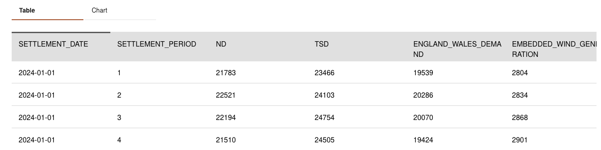

# Data

This project uses two different data sources:

* Historic electricity consumption in the UK from the National Grid
* Weather data from the MET Office.

## Electricity demand data
The historic electricity demand data is collated by National Grid, who operate the electricity grid in the UK. The data spans from 2009 to the current date and it can be accessed using [their API](https://www.nationalgrideso.com/data-portal/historic-demand-data). The data is often updated on a daily basis, but the update frequency isn't a problem since this dataset is only used for training and testing of ML models and not for inference. All the data is available and therefore the data can be accessed when needed. 

The dataset contains a total of 21 columns such as total electricity demand, renewable energy capacity, interconnector flow, etc ( a description of all the columns can be found [here](https://www.nationalgrideso.com/data-portal/historic-demand-data/historic_demand_data_2024)). However, only three columns are used as part of model training:
* SETTLEMENT_DATA